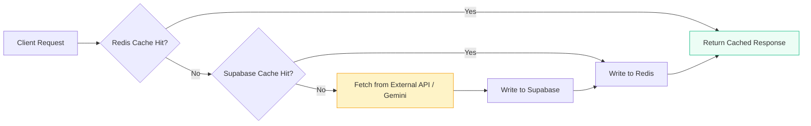
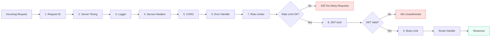
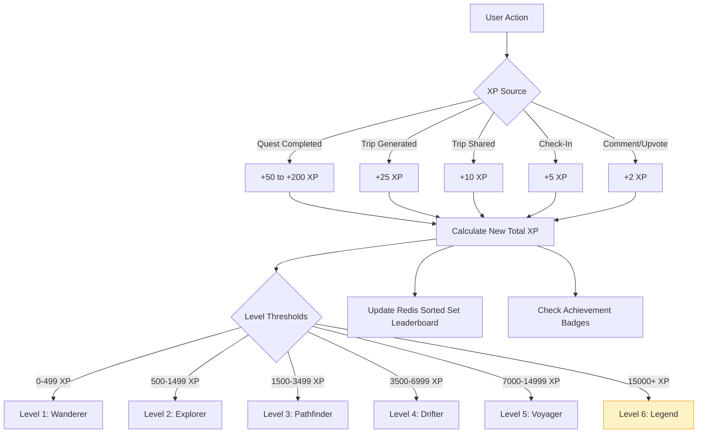
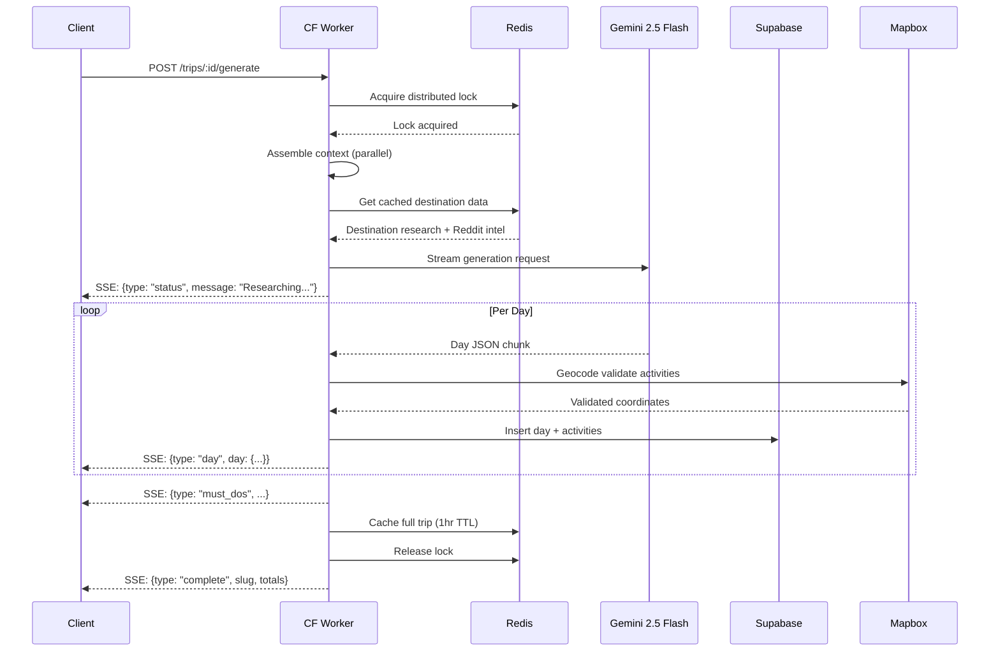

# Drift App — Flow Diagram

## Complete Application Flow

```mermaid
flowchart TD
    START((User Opens App))

    %% ─── AUTH ───
    START --> AUTH_CHECK{Authenticated?}
    AUTH_CHECK -->|No| GUEST_OR_AUTH{Sign Up or Try as Guest?}
    AUTH_CHECK -->|Yes| HOME

    GUEST_OR_AUTH -->|Sign Up / Login| AUTH_FLOW
    GUEST_OR_AUTH -->|Try as Guest| GUEST_FLOW

    subgraph GUEST_FLOW[Guest Session]
        GUEST_CREATE["POST /auth/guest"]
        GUEST_TOKEN[Guest Token Issued — 72h TTL]
        GUEST_CREATE --> GUEST_TOKEN
    end

    GUEST_TOKEN --> GUEST_HOME[Home — Guest Mode]

    subgraph AUTH_FLOW[Authentication]
        SIGNUP[POST /auth/signup]
        LOGIN[POST /auth/login]
        OAUTH_G[POST /auth/oauth/google]
        SIGNUP --> JWT_ISSUED
        LOGIN --> JWT_ISSUED
        OAUTH_G --> JWT_ISSUED
        JWT_ISSUED[JWT + Refresh Token Issued]
    end

    JWT_ISSUED --> HOME

    %% ─── GUEST HOME (limited) ───
    GUEST_HOME --> NEW_TRIP
    GUEST_HOME --> LIBRARY_BROWSE
    GUEST_HOME -->|Locked| GUEST_UPGRADE_1["🔒 Sign up to unlock"]

    %% ─── HOME ───
    HOME[Home Screen]
    HOME --> NEW_TRIP[Create New Trip]
    HOME --> MY_TRIPS[My Trips]
    HOME --> LIBRARY_BROWSE[Browse Library]
    HOME --> FEED_VIEW[Social Feed]
    HOME --> PROFILE_VIEW[My Profile]
    HOME --> LORE_HUB[Drift Lore Hub]

    %% ─── GUEST MIGRATION ───
    subgraph GUEST_MIGRATION[Guest → Account Migration]
        direction TB
        MIG_SIGNUP["POST /auth/signup + X-Guest-Token"]
        MIG_TRANSFER[Transfer trip ownership]
        MIG_CLEANUP[Delete guest session from Redis]
        MIG_SIGNUP --> MIG_TRANSFER --> MIG_CLEANUP
    end

    GUEST_UPGRADE_1 --> GUEST_MIGRATION
    GUEST_MIGRATION --> HOME

    %% ═══════════════════════════════════════
    %% TRIP CREATION & ONBOARDING
    %% ═══════════════════════════════════════

    subgraph ONBOARDING[Trip Onboarding Wizard]
        direction TB
        OB_1[Step 1: Search Destination]
        OB_2[Step 2: Select Dates]
        OB_3[Step 3: Transport Mode]
        OB_4[Step 4: Traveler Profile]
        OB_5[Step 5: Pick Interests]
        OB_6[Step 6: Review & Generate]

        OB_1 --> OB_2 --> OB_3 --> OB_4 --> OB_5 --> OB_6
    end

    NEW_TRIP --> ONBOARDING

    subgraph OB_APIS[Onboarding API Calls]
        direction TB
        DEST_SEARCH["GET /destinations/search?q="]
        DEST_PREFETCH[POST /destinations/:key/prefetch]
        DEST_INTERESTS[GET /destinations/:key/interests]
        DEST_MUSTDOS[GET /destinations/:key/must-dos]
        DEST_TRANSPORT["GET /destinations/:key/transport?origin="]
        WEATHER_FETCH["GET /weather?lat=&lng=&start=&end="]
        CURRENCY_FETCH["GET /currency/rates?base=&targets="]
    end

    OB_1 -->|User types| DEST_SEARCH
    DEST_SEARCH -->|Mapbox Geocoding| DEST_SEARCH_RESULT[Autocomplete Results]
    DEST_SEARCH_RESULT -->|User selects| DEST_PREFETCH
    DEST_PREFETCH -->|Fire & forget| BG_RESEARCH

    subgraph BG_RESEARCH[Background Research via QStash]
        direction LR
        REDDIT_FETCH[Fetch Reddit Intel]
        AI_RESEARCH[Gemini: Destination Research]
        REDDIT_FETCH --> CACHE_REDIS_1[(Redis Cache)]
        AI_RESEARCH --> CACHE_REDIS_1
    end

    OB_3 --> DEST_TRANSPORT
    OB_5 --> DEST_INTERESTS
    OB_5 --> DEST_MUSTDOS
    OB_2 --> WEATHER_FETCH
    OB_2 --> CURRENCY_FETCH

    %% ═══════════════════════════════════════
    %% TRIP GENERATION
    %% ═══════════════════════════════════════

    OB_6 -->|POST /trips| CREATE_TRIP[Create Trip Draft in DB]
    CREATE_TRIP -->|POST /trips/:id/generate| GEN_START

    subgraph GENERATION[AI Itinerary Generation Pipeline]
        direction TB
        GEN_START[Start Generation]
        GEN_LOCK{Acquire Redis Lock}
        GEN_LOCK -->|Locked by another| GEN_WAIT[Return: Already Generating]
        GEN_LOCK -->|Acquired| GEN_CONTEXT

        subgraph GEN_CONTEXT[Assemble Context — Parallel]
            direction LR
            CTX_PREFS[Trip Preferences]
            CTX_DEST[Destination Research]
            CTX_REDDIT[Reddit Intel]
            CTX_WEATHER[Weather Data]
            CTX_RATES[Exchange Rates]
            CTX_MUSTDOS[Must-Dos]
            CTX_INTERESTS[Selected Interests]
            CTX_DNA[Travel DNA — User Profile]
            CTX_HISTORY[Past Trip Summaries]
            CTX_FEEDBACK[Activity Feedback History]
            CTX_VISITED[Previously Visited Places]
        end

        GEN_CONTEXT --> GEN_PROMPT[Build Gemini Prompt]
        GEN_PROMPT --> GEN_STREAM

        subgraph GEN_STREAM[Gemini 2.5 Flash Streaming]
            direction TB
            SSE_STATUS["SSE: {type: 'status', message}"]
            SSE_DAY["SSE: {type: 'day', day: DayResponse}"]
            SSE_MUSTDOS["SSE: {type: 'must_dos', ...}"]
            SSE_COMPLETE["SSE: {type: 'complete', slug, totals}"]
            SSE_STATUS --> SSE_DAY
            SSE_DAY -->|Per day| SSE_DAY
            SSE_DAY --> SSE_MUSTDOS
            SSE_MUSTDOS --> SSE_COMPLETE
        end

        GEN_STREAM --> GEN_POST

        subgraph GEN_POST[Post-Processing — Parallel per Day]
            direction LR
            PP_GEO[Mapbox Geocode Validation]
            PP_TA[TripAdvisor Enrichment]
            PP_MUSTDO[Must-Do Cross-Reference]
            PP_COSTS[Compute Running Totals]
            PP_TRANSIT[Generate Transit Polylines]
        end

        GEN_POST --> GEN_SAVE[Batch Insert to Supabase]
        GEN_SAVE --> GEN_CACHE[Cache in Redis — 1hr TTL]
    end

    GEN_START --> GEN_LOCK

    %% ═══════════════════════════════════════
    %% ITINERARY VIEW & EDITING
    %% ═══════════════════════════════════════

    GEN_CACHE --> ITIN_VIEW[View Generated Itinerary]

    %% ═══════════════════════════════════════
    %% TRIP COLLABORATION
    %% ═══════════════════════════════════════

    ITIN_VIEW --> COLLAB_START[Invite Friends / Manage Members]

    subgraph COLLABORATION[Trip Collaboration]
        direction TB
        INVITE["POST /trips/:id/invite/:userId"]
        REQUEST_JOIN["POST /trips/:id/request-join"]
        RESPOND["PATCH /trips/:id/members/:memberId"]
        LIST_MEMBERS["GET /trips/:id/members"]
        CHANGE_ROLE["PATCH /trips/:id/members/:memberId/role"]
        REMOVE_MEMBER["DELETE /trips/:id/members/:memberId"]

        INVITE --> RESPOND
        REQUEST_JOIN --> RESPOND
        RESPOND -->|Accepted| LIST_MEMBERS
    end

    COLLAB_START --> INVITE
    COLLAB_START --> LIST_MEMBERS

    subgraph EDITING[Itinerary Editing]
        direction TB
        EDIT_ACTIVITY["PATCH /trips/:id/activities/:activityId"]
        ADD_ACTIVITY["POST /trips/:id/days/:dayId/activities"]
        DEL_ACTIVITY["DELETE /trips/:id/activities/:activityId"]
        REORDER["PATCH /trips/:id/days/:dayId/reorder"]
        MOVE_ACTIVITY["POST /trips/:id/days/:dayId/move-activity"]
        REGEN_DAY["POST /trips/:id/regenerate-day/:day"]
        SWAP["POST /trips/:id/swap-activity/:activityId"]
        APPLY_SWAP["POST /trips/:id/apply-swap"]
        SURPRISE["POST /trips/:id/surprise-me"]
        ADJUST_PACE["POST /trips/:id/adjust-pace/:day"]
        ADD_DAY["POST /trips/:id/add-day"]
        REMOVE_DAY["DELETE /trips/:id/remove-day/:day"]
    end

    ITIN_VIEW --> EDITING
    SWAP -->|Gemini generates 3-4 alternatives| SWAP_RESULT[SwapAlternativesResponse]
    SWAP_RESULT -->|User picks one| APPLY_SWAP
    REGEN_DAY -->|SSE stream| GEN_STREAM
    SURPRISE -->|Gemini adds hidden gems| ITIN_VIEW

    %% ═══════════════════════════════════════
    %% BOOKING
    %% ═══════════════════════════════════════

    ITIN_VIEW --> BOOKING_START[View Booking Options]

    subgraph BOOKING[Booking Flow]
        direction TB
        BOOK_OPTIONS["GET /trips/:id/booking-options"]
        CART_ADD["POST /trips/:id/cart/add"]
        CART_VIEW["GET /trips/:id/cart"]
        CART_UPDATE["PATCH /trips/:id/cart/:itemId"]
        CART_REMOVE["DELETE /trips/:id/cart/:itemId"]
        CHECKOUT["POST /trips/:id/cart/checkout"]

        BOOK_OPTIONS --> CART_ADD
        CART_ADD --> CART_VIEW
        CART_VIEW --> CART_UPDATE
        CART_VIEW --> CART_REMOVE
        CART_VIEW --> CHECKOUT
    end

    BOOKING_START --> BOOK_OPTIONS
    CHECKOUT --> AFFILIATE_REDIRECT[Affiliate Links → Provider Sites]
    CHECKOUT --> BOOKING_CONFIRM["GET /trips/:id/bookings"]

    %% ═══════════════════════════════════════
    %% LIVE TRIP COMPANION
    %% ═══════════════════════════════════════

    ITIN_VIEW --> LIVE_START

    subgraph LIVE[Live Trip Companion]
        direction TB
        LIVE_START["POST /live/start/:tripId"]
        LIVE_CHECKIN["POST /live/checkin"]
        LIVE_STATUS["GET /live/:tripId/status"]
        LIVE_SKIP["POST /live/:tripId/skip-activity"]
        LIVE_LATE["POST /live/:tripId/running-late"]
        LIVE_NEARBY["GET /live/:tripId/nearby"]
        LIVE_WS["WS /live/:tripId/ws"]

        LIVE_START --> LIVE_STATUS
        LIVE_STATUS --> LIVE_CHECKIN
        LIVE_CHECKIN --> GEOFENCE_CHECK{Within Geofence?}
        GEOFENCE_CHECK -->|Yes| AUTO_CHECKIN[Auto Check-In + XP]
        GEOFENCE_CHECK -->|No| MANUAL_CHECKIN[Manual Check-In]
        LIVE_STATUS --> LIVE_SKIP
        LIVE_STATUS --> LIVE_LATE
        LIVE_LATE -->|Gemini recalculates| LIVE_STATUS
        LIVE_STATUS --> LIVE_NEARBY
    end

    LIVE_WS --> GROUP_SYNC[Real-Time Group Sync via Durable Objects]

    %% ═══════════════════════════════════════
    %% DRIFT LORE & GAMIFICATION
    %% ═══════════════════════════════════════

    LORE_HUB --> LORE_FLOW

    subgraph LORE_FLOW[Drift Lore System]
        direction TB
        QUEST_LIST["GET /lore/quests?destination=&type="]
        QUEST_NEARBY["GET /lore/quests/nearby?lat=&lng="]
        QUEST_ACTIVE["GET /lore/quests/active/:tripId"]
        QUEST_DETAIL["GET /lore/quests/:id"]

        QUEST_LIST --> QUEST_DETAIL
        QUEST_NEARBY --> QUEST_DETAIL
        QUEST_ACTIVE --> QUEST_DETAIL

        QUEST_DETAIL --> QUEST_ACCEPT[User Accepts Quest]
        QUEST_ACCEPT --> QUEST_COMPLETE["POST /lore/complete"]
    end

    QUEST_COMPLETE --> PHOTO_PIPELINE
    %% ═══════════════════════════════════════
    %% GROUP CHALLENGES
    %% ═══════════════════════════════════════

    ITIN_VIEW --> CHALLENGES_START[Group Challenges]

    subgraph GROUP_CHALLENGES[Group Challenges — Shared Trips Only]
        direction TB
        CH_CREATE[\"POST /trips/:id/challenges\"]
        CH_LIST[\"GET /trips/:id/challenges\"]
        CH_DETAIL[\"GET /trips/:id/challenges/:id\"]
        CH_PROGRESS[\"POST .../progress — Auto or Manual\"]
        CH_LEADER[\"GET .../leaderboard\"]

        CH_CREATE --> CH_LIST
        CH_LIST --> CH_DETAIL
        CH_DETAIL --> CH_PROGRESS
        CH_PROGRESS --> CH_LEADER
        CH_LEADER -->|Winner determined| CH_REWARD[Bonus XP Granted]
    end

    CHALLENGES_START --> CH_CREATE
    CHALLENGES_START --> CH_LIST
    QUEST_COMPLETE -->|Auto-updates| CH_PROGRESS
    AUTO_CHECKIN -->|Auto-updates| CH_PROGRESS
    subgraph PHOTO_PIPELINE[Photo Verification Pipeline]
        direction TB
        PH_UPLOAD[Upload Photo to R2]
        PH_EXIF[Extract EXIF: GPS + Timestamp]
        PH_GEO_CHECK{GPS Within Geofence?}
        PH_MODERATION[Google Cloud Vision SafeSearch]
        PH_MOD_CHECK{Content Safe?}
        PH_VISION[Gemini 2.5 Flash Vision Verify]
        PH_CONFIDENCE{Confidence Score?}
        PH_FRAUD[Anti-Fraud: Hash + Reverse Search]

        PH_UPLOAD --> PH_EXIF
        PH_EXIF --> PH_GEO_CHECK
        PH_GEO_CHECK -->|No| PH_REJECT_GEO[Reject: Outside Geofence]
        PH_GEO_CHECK -->|Yes| PH_MODERATION
        PH_MODERATION --> PH_MOD_CHECK
        PH_MOD_CHECK -->|VERY_LIKELY unsafe| PH_REJECT_MOD[Auto-Reject]
        PH_MOD_CHECK -->|LIKELY unsafe| PH_MANUAL[Manual Review Queue]
        PH_MOD_CHECK -->|Safe| PH_VISION
        PH_VISION --> PH_CONFIDENCE
        PH_CONFIDENCE -->|">= 0.85"| PH_VERIFIED[Auto-Verified ✓]
        PH_CONFIDENCE -->|">= 0.50"| PH_MANUAL
        PH_CONFIDENCE -->|"< 0.50"| PH_REJECT_AI[Auto-Reject]
        PH_VERIFIED --> PH_FRAUD
        PH_FRAUD --> REWARD_GRANT
    end

    subgraph REWARD_GRANT[Reward Granting]
        direction TB
        XP_GRANT[Grant XP]
        LEVEL_CHECK{Level Up?}
        ACHIEVEMENT_CHECK[Check Achievement Triggers]
        LEADERBOARD_UPDATE[Update Redis Leaderboard]
        BONUS_REWARD[Grant Bonus Reward / Discount]
        NOTIFICATION_SEND[Send Push Notification]
        FEED_ADD[Add to Social Feed]

        XP_GRANT --> LEVEL_CHECK
        LEVEL_CHECK -->|Yes| LEVEL_UP_NOTIFY[Level Up! Notification]
        LEVEL_CHECK -->|No| ACHIEVEMENT_CHECK
        LEVEL_UP_NOTIFY --> ACHIEVEMENT_CHECK
        ACHIEVEMENT_CHECK --> LEADERBOARD_UPDATE
        LEADERBOARD_UPDATE --> BONUS_REWARD
        BONUS_REWARD --> NOTIFICATION_SEND
        NOTIFICATION_SEND --> FEED_ADD
    end

    %% ═══════════════════════════════════════
    %% GAMIFICATION VIEWS
    %% ═══════════════════════════════════════

    subgraph GAMIFICATION[Gamification]
        direction TB
        GAM_PROFILE["GET /gamification/me"]
        GAM_LEADER["GET /gamification/leaderboard?scope="]
        GAM_ACHIEVE["GET /gamification/achievements/me"]
        GAM_REWARDS["GET /gamification/rewards/me"]
        GAM_REDEEM["POST /gamification/rewards/:id/redeem"]

        GAM_REWARDS --> GAM_REDEEM
    end

    PROFILE_VIEW --> GAMIFICATION

    %% ═══════════════════════════════════════
    %% SOCIAL FEED
    %% ═══════════════════════════════════════

    subgraph SOCIAL[Social & Community]
        direction TB
        FEED_GLOBAL["GET /feed"]
        FEED_DEST["GET /feed/destination/:key"]
        FEED_FOLLOW_VIEW["GET /feed/following"]
        FEED_TRENDING["GET /feed/trending"]

        UPVOTE["POST /social/upvote/:targetType/:id"]
        SAVE["POST /social/save/:tripId"]
        COMMENT["POST /social/comment"]
        FOLLOW["POST /social/follow/:userId"]
        REPORT["POST /social/report"]

        FEED_GLOBAL --> UPVOTE
        FEED_GLOBAL --> SAVE
        FEED_GLOBAL --> COMMENT
        FEED_GLOBAL --> FOLLOW
        FEED_GLOBAL --> REPORT
    end

    FEED_VIEW --> SOCIAL

    %% ═══════════════════════════════════════
    %% LIBRARY
    %% ═══════════════════════════════════════

    subgraph LIBRARY[Public Itinerary Library]
        direction TB
        LIB_BROWSE["GET /library"]
        LIB_SEARCH["GET /library/search?q="]
        LIB_TRENDING["GET /library/trending"]
        LIB_DESTS["GET /library/destinations"]
        LIB_CLONE["POST /library/clone/:tripId"]

        LIB_BROWSE --> LIB_CLONE
        LIB_SEARCH --> LIB_CLONE
        LIB_TRENDING --> LIB_CLONE
    end

    LIBRARY_BROWSE --> LIBRARY
    LIB_CLONE -->|Fork as draft| ITIN_VIEW

    subgraph LIB_SEARCH_PIPELINE[Semantic Search Pipeline]
        direction LR
        EMBED_QUERY[Embed Query — Gemini text-embedding-004]
        VECTOR_SEARCH[pgvector Cosine Similarity]
        KEYWORD_FILTER[+ Keyword Filters]
        RANKED_RESULTS[Ranked Results]

        EMBED_QUERY --> VECTOR_SEARCH --> KEYWORD_FILTER --> RANKED_RESULTS
    end

    LIB_SEARCH --> LIB_SEARCH_PIPELINE

    %% ═══════════════════════════════════════
    %% EXPORT & SHARE
    %% ═══════════════════════════════════════

    subgraph EXPORT[Export & Share]
        direction TB
        EXP_PDF["GET /export/:tripId/pdf"]
        EXP_SHARE["GET /export/:tripId/share"]
        EXP_ICAL["GET /export/:tripId/ical"]
        EXP_GPX["GET /export/:tripId/gpx"]
    end

    ITIN_VIEW --> EXPORT
    EXP_PDF --> R2_STORAGE[(Cloudflare R2)]
    EXP_SHARE --> OG_META[OG Metadata + Share URL]

    %% ═══════════════════════════════════════
    %% USER PROFILE
    %% ═══════════════════════════════════════

    subgraph PROFILE[User Profile]
        direction TB
        PROF_ME["GET /profiles/me"]
        PROF_UPDATE["PATCH /profiles/me"]
        PROF_PUBLIC["GET /profiles/:username"]
        PROF_TRIPS["GET /profiles/me/trips"]
        PROF_SAVED["GET /profiles/me/saved"]
        PROF_NOTIF["GET /profiles/me/notifications"]
        PROF_STATS["GET /profiles/me/stats"]
        PROF_AVATAR["PUT /profiles/me/avatar"]

        PROF_AVATAR --> R2_STORAGE
    end

    PROFILE_VIEW --> PROFILE
    MY_TRIPS --> PROF_TRIPS
    PROF_TRIPS --> ITIN_VIEW

    %% ═══════════════════════════════════════
    %% ADMIN
    %% ═══════════════════════════════════════

    subgraph ADMIN[Admin & Moderation]
        direction TB
        ADMIN_REPORTS["GET /admin/reports"]
        ADMIN_RESOLVE["PATCH /admin/reports/:id"]
        ADMIN_STATS["GET /admin/stats"]
        ADMIN_QUEST_CREATE["POST /admin/quests"]
        ADMIN_PHOTOS["GET /admin/moderation/photos"]
        ADMIN_PHOTO_REVIEW["PATCH /admin/moderation/photos/:id"]
        ADMIN_CACHE["POST /admin/cache/invalidate"]
        ADMIN_BAN["PATCH /admin/users/:id/ban"]

        ADMIN_REPORTS --> ADMIN_RESOLVE
        ADMIN_PHOTOS --> ADMIN_PHOTO_REVIEW
    end

    PH_MANUAL --> ADMIN_PHOTOS
    REPORT --> ADMIN_REPORTS

    %% ═══════════════════════════════════════
    %% ACTIVITY FEEDBACK & TRIP PHOTOS
    %% ═══════════════════════════════════════

    ITIN_VIEW --> FEEDBACK_START[Rate Activities & Upload Photos]

    subgraph FEEDBACK[Activity Feedback & Trip Photos]
        direction TB
        FB_RATE["POST /trips/:id/activities/:activityId/feedback"]
        FB_LIST["GET /trips/:id/feedback"]
        PH_TRIP_UPLOAD["POST /trips/:id/photos"]
        PH_TRIP_LIST["GET /trips/:id/photos"]
        PH_TRIP_DELETE["DELETE /trips/:id/photos/:photoId"]

        FB_RATE --> FB_LIST
        PH_TRIP_UPLOAD --> PH_TRIP_LIST
        PH_TRIP_UPLOAD --> R2_STORAGE
    end

    FEEDBACK_START --> FB_RATE
    FEEDBACK_START --> PH_TRIP_UPLOAD

    %% ═══════════════════════════════════════
    %% TRIP COMPLETION & MEMORIES
    %% ═══════════════════════════════════════

    subgraph TRIP_COMPLETION[Trip Completion & Memory Generation]
        direction TB
        TRIP_COMPLETE["POST /trips/:id/complete"]
        COLLECT_SIGNALS[Collect: Check-ins + Skips + Feedback + Photos + Quests + Challenges]
        GEN_MEMORY[Gemini: Generate Memory Summary + Highlights]
        UPDATE_DNA[Gemini: Update Travel DNA]
        SAVE_MEMORY[Save Memory to DB]

        TRIP_COMPLETE --> COLLECT_SIGNALS
        COLLECT_SIGNALS --> GEN_MEMORY
        COLLECT_SIGNALS --> UPDATE_DNA
        GEN_MEMORY --> SAVE_MEMORY
        UPDATE_DNA --> SAVE_DNA[Update profiles.travel_dna]
    end

    LIVE --> TRIP_COMPLETION

    subgraph MEMORIES[Trip History & Memories]
        direction TB
        MEM_HISTORY["GET /trips/history"]
        MEM_DETAIL["GET /trips/:id/memories"]

        MEM_HISTORY --> MEM_DETAIL
    end

    MY_TRIPS --> MEM_HISTORY
    MEM_DETAIL --> ITIN_VIEW

    %% ═══════════════════════════════════════
    %% INFRASTRUCTURE LAYER
    %% ═══════════════════════════════════════

    subgraph INFRA[Infrastructure Layer]
        direction LR
        SUPABASE[(Supabase PostgreSQL)]
        REDIS[(Upstash Redis)]
        R2[(Cloudflare R2)]
        QSTASH[Upstash QStash]
        GEMINI[Gemini 2.5 Flash]
        CLOUD_VISION[Google Cloud Vision]
        MAPBOX_SVC[Mapbox Geocoding]
        OPEN_METEO[Open-Meteo Weather]
        EXCHANGE_API[ExchangeRate-API]
    end

    %% ─── STYLING ───
    style START fill:#4F46E5,color:#fff
    style AUTH_FLOW fill:#F0FDF4,stroke:#22C55E
    style ONBOARDING fill:#EFF6FF,stroke:#3B82F6
    style GENERATION fill:#FEF3C7,stroke:#F59E0B
    style GEN_STREAM fill:#FDE68A,stroke:#D97706
    style PHOTO_PIPELINE fill:#FEE2E2,stroke:#EF4444
    style REWARD_GRANT fill:#ECFDF5,stroke:#10B981
    style LIVE fill:#F5F3FF,stroke:#8B5CF6
    style INFRA fill:#F8FAFC,stroke:#94A3B8
```

---

## Data Flow: Multi-Layer Cache



---

## Request Lifecycle: Middleware Chain



---

## XP & Level Progression



---

## SSE Streaming: Itinerary Generation


